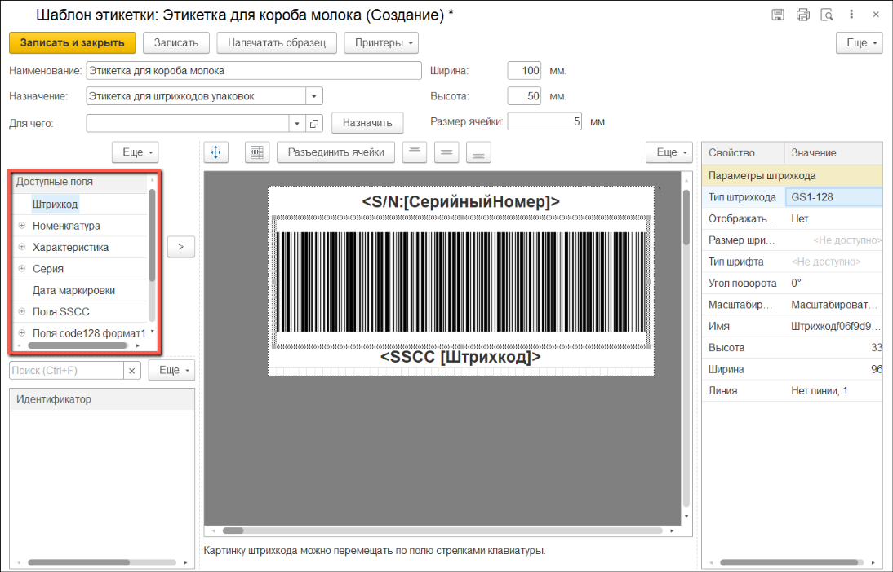
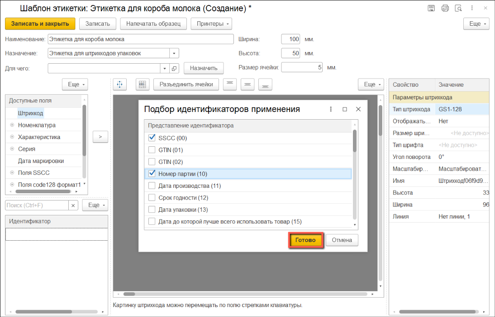
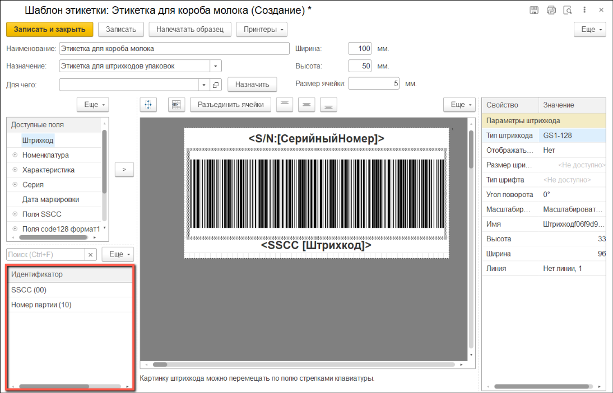
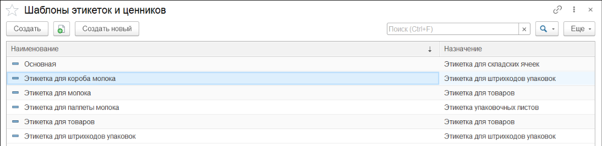
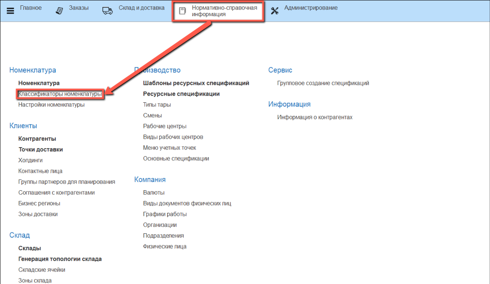
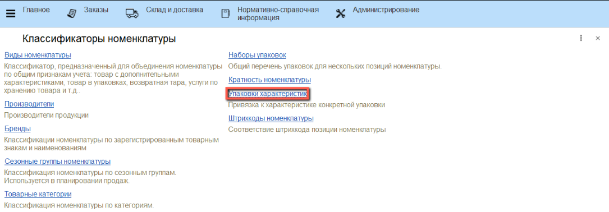

Для создания этикетки короба нужно в **"Назначении"** выбрать **"Этикетка для штрихкодов упаковок"**.

Cтандартный шаблон включает в себя *Серийный номер* и *Штрихкод с типом GS1 DataBar Expanded Stacked*

Для настройки собственного шаблона нажимаем на **"Изменить в редакторе"**

Открывается окно конструктора этикетки.

Мы можем изменить высоту и ширину этикетки, для этого вводим значения в соответствующие поля сверху

В качестве типа штрихкода имеется возможность выбора *GS1 DataBar Expanded Stacked* или *GS1-128*

Список всех доступных полей для добавления на этикетку расположен в меню слева.

Для того, чтобы использовать идентификаторы применения GS1, помимо добавления на шаблон этикетки, их нужно добавить в таблицу ниже. Для этого нажимаем на кнопку **"Ещё"** и выбираем **"Подбор"**

Выбираем нужные идентификаторы и нажимаем **"Готово"**

Выбранные идентификаторы отобразятся в таблице.

Список доступных полей для печати в стационарной маркировке:

| Идентификатор                                                     | Описание                                          | Обязательный                                                      |
| ----------------------------------------------------------------- | ------------------------------------------------- | ----------------------------------------------------------------- |
| SSCC (00)                                                    | Серийный код транспортной упаковки                                     | Нет                                                            |
| GTIN (01)                                                    | Глобальный номер предмета торговли                                     | Да                                                  |
| GTIN (02)                                                    | GTIN предметов торговли содержимого логистической единицы                                      | Нет                                                 |
| Номер партии (10)                                            | Номер серии                                   | Да                                                  |
| Дата производства (11)                                       | Дата изготовления                             | Да                                                  |
| Срок годности (12)                                           | Дата, до которой товар считается пригодным для использования                                | Нет                                                 |
| Дата упаковки (13)                                           | Дата упаковывания                             | Нет                                                 |
| Дата до которой лучше всего использовать товар (15)          | Дата реализации                               | Нет                                                 |
| Дата истечения срока годности (17)                           | Дата окончания срока годности                 | Нет                                                 |
| Вариант исполнения (20)                                      | Вариант продукции                             | Нет                                                 |
| Серийный номер (21)                                          | Номер короба в серии                          | Да                                                 |
| Дополнительный идентификатор (240)                           | Дополнительная идентификация предмета                                     | Нет                                                 |
| Количество единиц (30)                                       | Число штучных предметов                       | Нет                                                 |
| Масса нетто в кг. (310X)                                     | Вес нетто, килограммы                         | Нет                                                 |
| Количество вложенных единиц (37)                             | Число предметов торговли                      | Нет                                                 |
| Дата истечения срока годности (скоропорт) (7003)             | Дата и время окончания срока годности                                     | Нет                                                 |
| Цена за единицу (8005)                                       | Цена за единицу величины                      | Нет                                                 |
| Дата/Время производства (8008)                               | Дата и время изготовления предмета торговли                                     | Нет                                                 |

Перед сохранением шаблона можно посмотреть как будет выглядеть этикетка. Для этого нужно нажать на кнопку **"Напечатать образец"**.

После добавления необходимых полей нажимаем **"Записать и закрыть"**.

Созданный шаблон появится в списке доступных этикеток.

Для того, чтобы установить сформированную этикетку, необходимо перейти в подсистему **"Нормативно-справочная информация"** и в разделе **"Номенклатура"** перейти в **"Классификаторы номенклатуры"**.

Далее нужно выбрать "Упаковки характеристик".

В открывшемся окне нажимаем **"Создать"**.

Выбираем новую этикетку и нажимаем **"Записать и закрыть"**.

Этикетка появится в списке.

