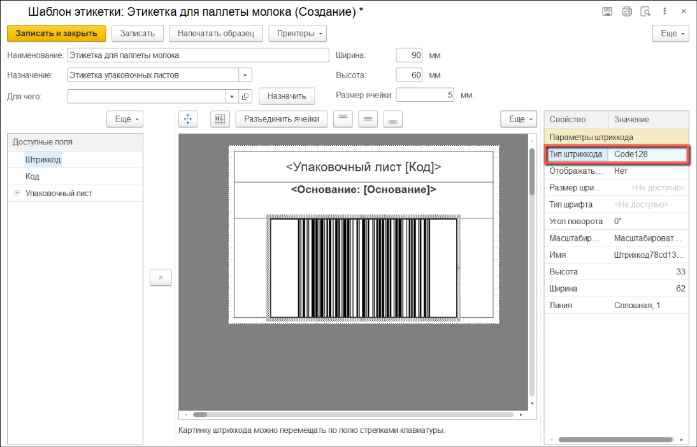
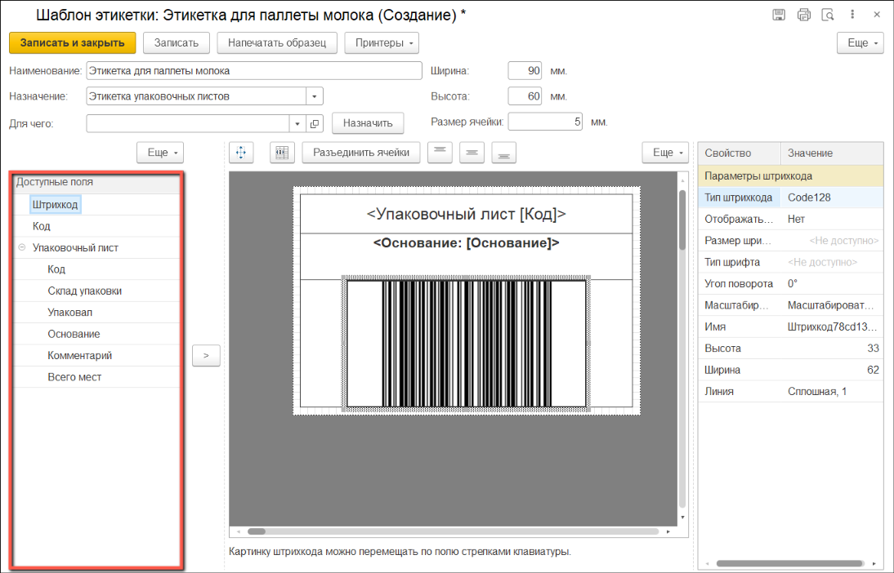
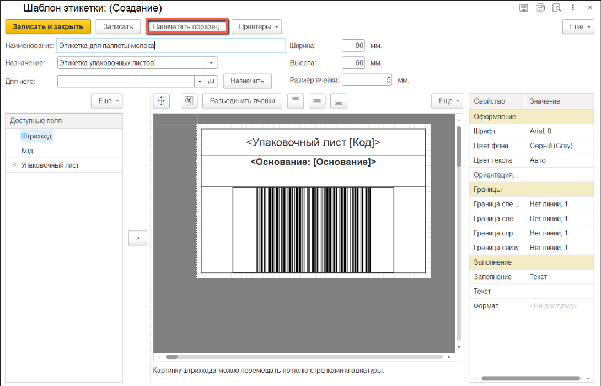
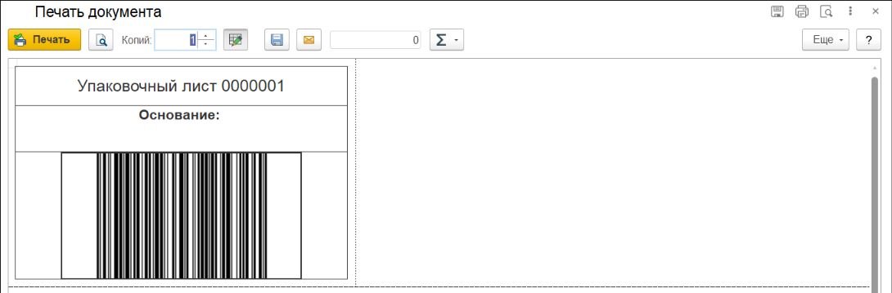

Для создания этикетки упаковочного листа нужно в **"Назначении"** выбрать **"Этикетка упаковочных листов"**.

Cтандартный шаблон включает в себя *Код*, *Основание* и *Штрихкод с типом Code128*.

Для настройки собственного шаблона нажимаем на **"Изменить в редакторе"**.

Открывается окно конструктора этикетки.

Мы можем изменить высоту и ширину этикетки, для этого вводим значения в соответствующие поля сверху.

В качестве типа штрихкода используется *Code128*.

Список всех доступных полей для добавления на этикетку расположен в меню слева.

Перед сохранением шаблона можно посмотреть как будет выглядеть этикетка. Для этого нужно нажать на кнопку **"Напечатать образец"**

После добавления необходимых полей нажимаем **"Записать и закрыть"**.
ы
Созданный шаблон появится в списке доступных этикеток.

Для того, чтобы установить сформированную этикетку, необходимо перейти в подсистему **"Склад и доставка"** и в разделе **"Сервис"** открыть **"Настройки склада и доставки"**.

В открывшемся окне в поле **"Шаблон этикетки упаковочного листа"** нужно выбрать новую этикетку.

