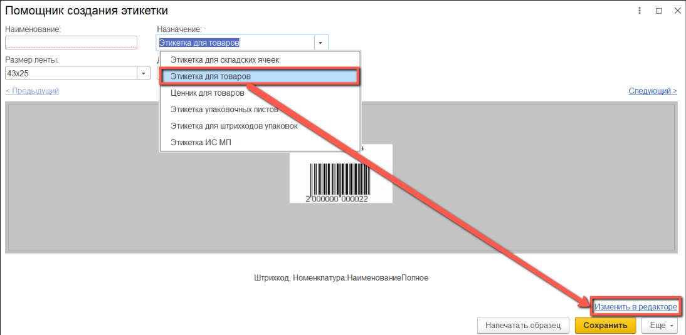
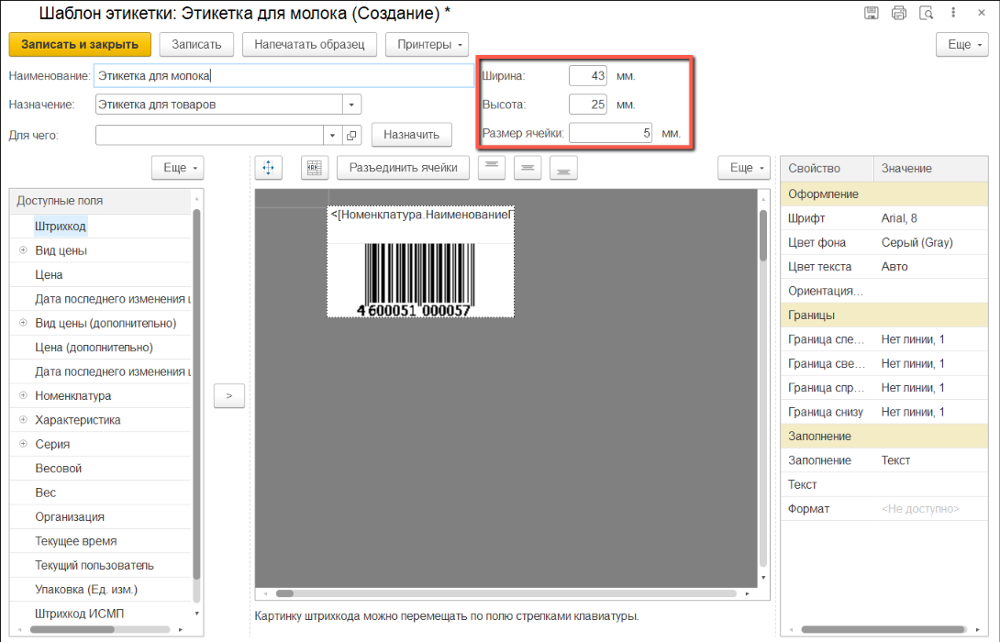
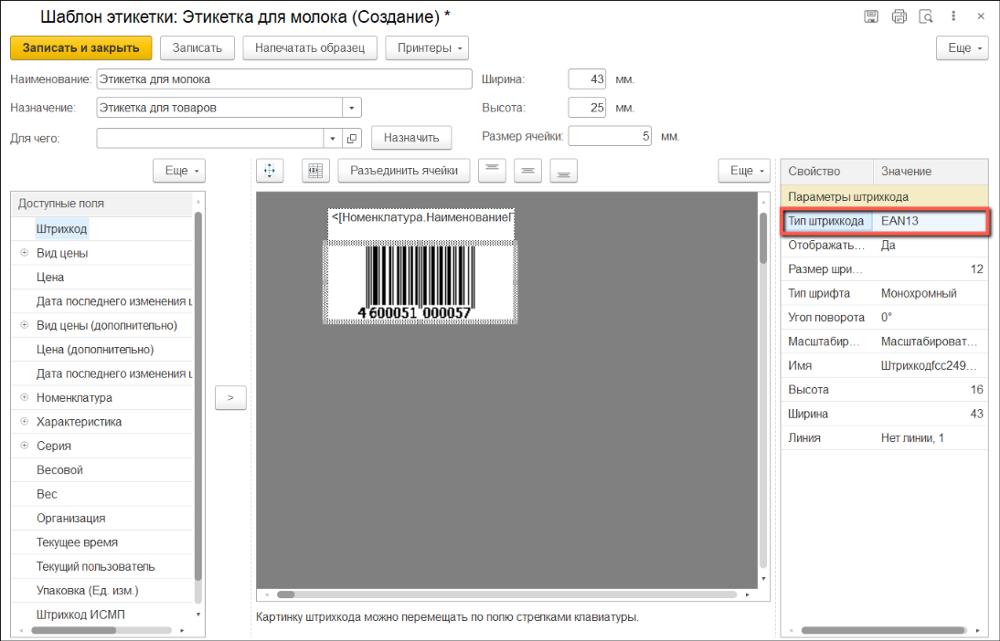
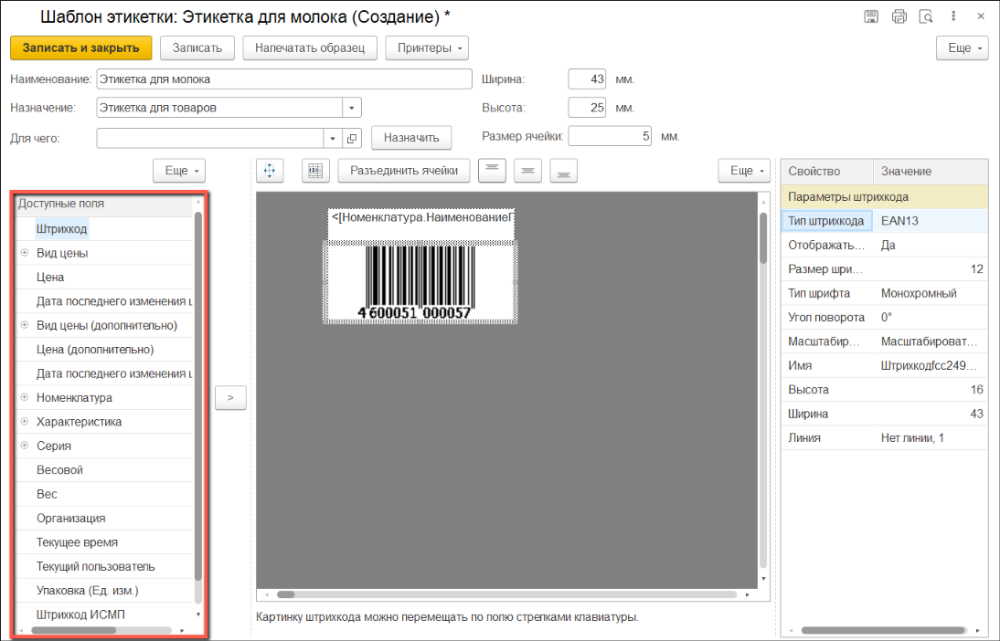
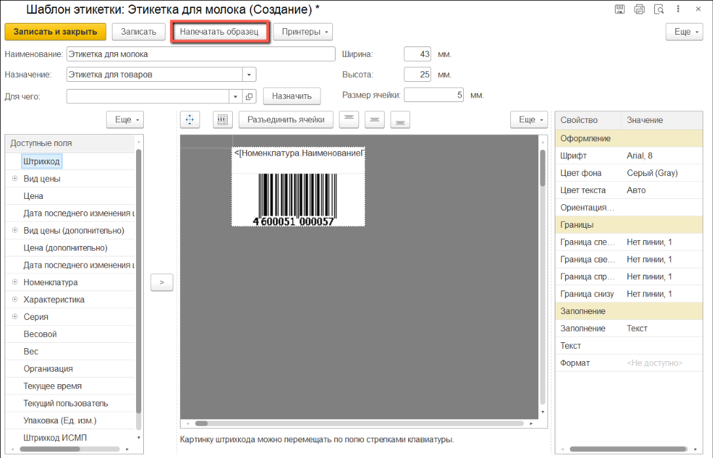
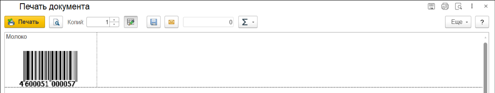
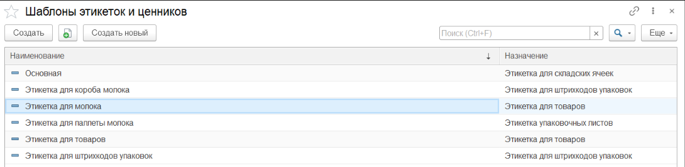
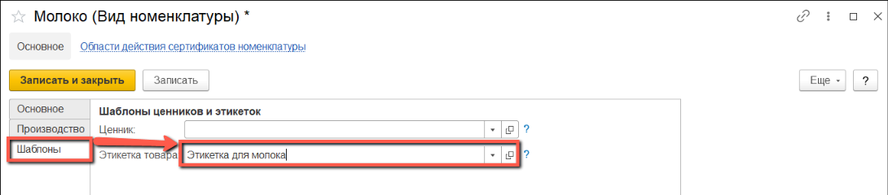
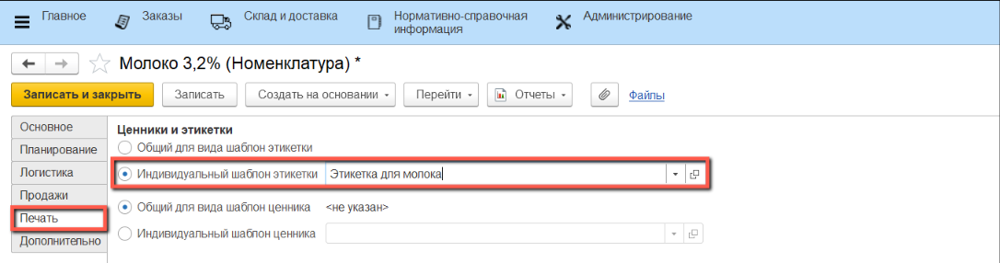

Для создания этикетки товара нужно в **"Назначении"** выбрать **"Этикетка для товаров"**.

Cтандартный шаблон включает в себя *Наименование* и *Штрихкод с типом EAN13*

Для настройки собственного шаблона нажимаем на **"Изменить в редакторе"**

Открывается окно конструктора этикетки.

Мы можем изменить высоту и ширину этикетки, для этого вводим значения в соответствующие поля сверху.

В качестве типа штрихкода имеется возможность выбора *EAN13* или *DataMatrix*

Список всех доступных полей для добавления на этикетку расположен в меню слева.

В случае добавления на этикетку *EAN13* выбираем *Штрихкод*, при добавлении *DataMatrix* выбираем *Штрихкод ИСМП*. На этикетку можно добавить оба штрихкода

Перед сохранением шаблона можно посмотреть как будет выглядеть этикетка. Для этого нужно нажать на кнопку **"Напечатать образец"**

После добавления необходимых полей нажимаем **"Записать и закрыть"**.

Созданный шаблон появится в списке доступных этикеток.

Сформированную этикетку можно установить для вида номенклатуры, либо для конкретной номенклатуры.

Чтобы установить этикетку для вида номенклатуры, необходимо открыть нужный вид, перейти к закладке **"Шаблоны"** и в поле **"Этикетка товара"** выбрать новый шаблон. Он будет по умолчанию применён для каждой номенклатуры, включённой в этот вид:

Чтобы установить этикетку для конкретной номенклатуры, необходимо открыть нужную позицию, перейти к закладке **"Печать"** и в поле **"Индивидуальный шаблон этикетки"** выбрать новый шаблон. Он будет применён только для этой номенклатуры:

