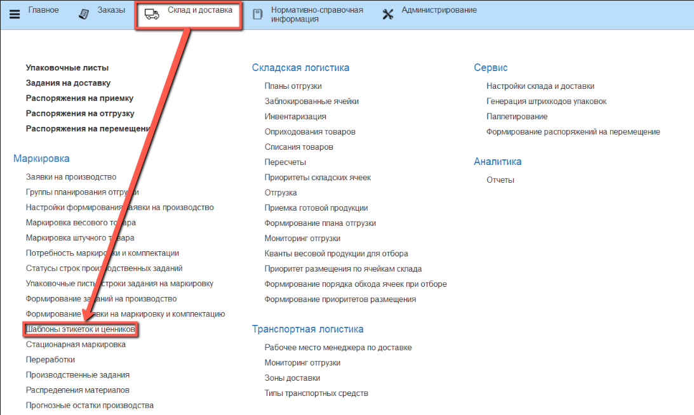
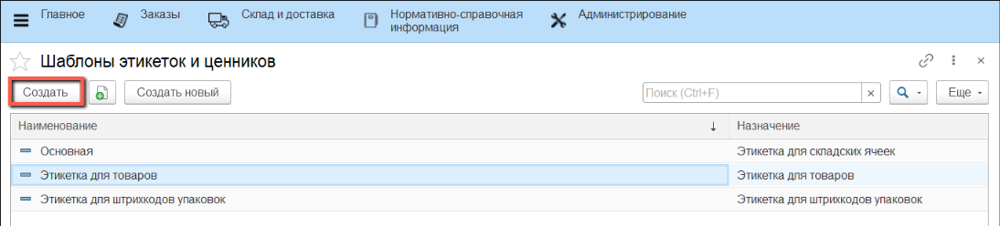


В системе существует возможность настраивать этикетки для товаров, коробов и паллет. Формирование этикетки производится по шаблону, который настраивается заранее. Имеется возможность редактировать шаблон этикетки под пользовательские потребности.

Для настройки этикеток необходимо перейти в подсистему **"Склад и доставка"** и в разделе **"Маркировка"** открыть справочник **"Шаблоны этикеток и ценников"**


- Для создания новой этикетки необходимо нажать на кнопку **"Создать"**

В открывшемся окне **"Помощник создания этикетки"** присутствуют следующие поля:

- Наименование - название будущего шаблона

- Назначение - тип, используемой этикетки (товар, короб, упаковочный лист)

- Размер ленты - указывается автоматически, в зависимости от назначения. При необходимости можно поменять вручную

- Для чего - возможность выбрать конкретную номенклатуру для этикетки товара, штрихкод короба для этикетки короба и упаковочный лист для этикетки упаковочного листа


